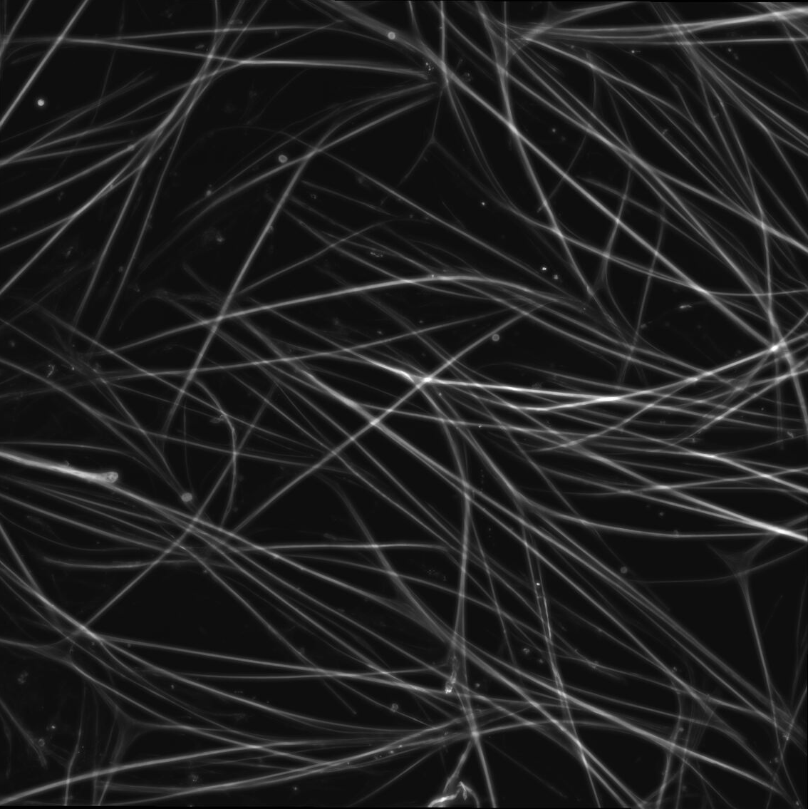

# Myotube Instance Segmentation with Mask2Former

An end-to-end deep learning pipeline for automated myotube instance segmentation in fluorescence microscopy images. This project adapts [Mask2Former](https://arxiv.org/abs/2112.01527) (CVPR 2022) — a state-of-the-art masked-attention transformer — for the biological domain, and provides a complete workflow from raw microscopy images to quantitative nuclei-myotube spatial analysis.

<div align="center">
  <table>
    <tr>
      <td align="center"><b>Raw Fluorescence Microscopy</b></td>
      <td align="center"><b>Instance Segmentation Output</b></td>
    </tr>
    <tr>
      <td></td>
      <td></td>
    </tr>
  </table>
  <p><i>Each detected myotube is assigned a unique color, enabling per-instance morphological analysis.</i></p>
</div>

## Motivation

Quantifying myotube morphology (length, width, branching) and nuclei positioning (central vs. peripheral) is essential for studying muscle differentiation and disease models such as centronuclear myopathy. Manual annotation is prohibitively slow for large imaging datasets. Existing general-purpose segmentation models fail on myotubes due to their extreme aspect ratios, dense overlap, and thin elongated geometry. This project addresses these challenges through domain-specific model training, tiled inference for high-resolution images, and a modular post-processing pipeline tuned for myotube characteristics.

## Key Contributions

- **Two-stage transfer learning strategy**: Fine-tunes a Swin-Large Mask2Former backbone first on algorithmically generated annotations (~90 images), then on manually curated annotations (~28 crops) for high-precision segmentation of thin, overlapping structures.
- **Tiled inference engine**: Splits large microscopy images into overlapping tiles (configurable grid with 20% overlap), runs inference per tile, and merges predictions — enabling segmentation of images with hundreds of densely packed myotubes that would exceed GPU memory in a single pass.
- **Domain-specific post-processing pipeline**: A modular, extensible pipeline that applies confidence filtering, aspect ratio constraints (min 1.5 length/width), area bounds, IoU-based instance merging, contained component elimination, and boundary smoothing.
- **Nuclei-myotube spatial analysis**: Automated classification of nuclei as central or peripheral relative to their enclosing myotube, with configurable overlap thresholds and grid-based spatial reference visualization.
- **Fiji/ImageJ integration**: Generates ROI composite files and measurement CSVs directly compatible with Fiji, bridging deep learning inference with established microscopy analysis workflows.

## Architecture Overview

```
                    ┌─────────────────────────────────┐
                    │     Raw Microscopy Images        │
                    │   (multi-channel TIFF stacks)    │
                    └──────────────┬──────────────────┘
                                   │
                    ┌──────────────▼──────────────────┐
                    │     Max Intensity Projection     │
                    │     (Z-stack → 2D)               │
                    └──────────────┬──────────────────┘
                                   │
                    ┌──────────────▼──────────────────┐
                    │     Tiled Inference Engine       │
                    │  ┌─────────────────────────┐    │
                    │  │  Mask2Former (Swin-L)   │    │
                    │  │  + Masked Attention      │    │
                    │  │  + Multi-scale Features  │    │
                    │  └─────────────────────────┘    │
                    └──────────────┬──────────────────┘
                                   │
                    ┌──────────────▼──────────────────┐
                    │   Post-Processing Pipeline       │
                    │   • Confidence thresholding      │
                    │   • Area & aspect ratio filter   │
                    │   • IoU-based merging            │
                    │   • Boundary smoothing           │
                    └──────────────┬──────────────────┘
                                   │
               ┌───────────────────┼───────────────────┐
               │                   │                   │
    ┌──────────▼────────┐ ┌───────▼────────┐ ┌───────▼────────┐
    │   Instance Masks   │ │  Fiji ROIs &   │ │  Nuclei-Myotube│
    │   & Overlays       │ │  Measurements  │ │  Analysis CSV  │
    └────────────────────┘ └────────────────┘ └────────────────┘
```

## GUI Application

A multi-tab GUI built with tkinter provides an accessible interface for the full pipeline:

<div align="center">
  
  <p><i>Fiji Integration GUI with four workflow tabs: Max Projection, Myotube Segmentation, CellPose Segmentation, and Nuclei-Myotube Analysis.</i></p>
</div>

| Tab | Function |
|-----|----------|
| **Max Projection** | Converts multi-channel Z-stack TIFFs into 2D max intensity projections |
| **Myotube Segmentation** | Runs Mask2Former inference with configurable confidence, area thresholds, and tiling |
| **CellPose Segmentation** | Alternative segmentation backend using [Cellpose](https://github.com/MouseLand/cellpose) |
| **Nuclei-Myotube Analysis** | Quantifies nuclei positioning (central vs. peripheral) with grid overlay visualization |

## Two-Stage Training

The model is trained using a two-stage transfer learning approach on top of a COCO-pretrained Swin-Large backbone:

| | Stage 1 | Stage 2 |
|---|---------|---------|
| **Data** | ~90 algorithmically annotated images | ~28 manually annotated crops |
| **Purpose** | Learn myotube morphology from noisy labels | Refine with high-quality human annotations |
| **Iterations** | 18,000 | 12,000 |
| **Learning Rate** | 1e-5 | 2e-5 |
| **Loss Weights** | mask=25, dice=2, class=2 | mask=20, dice=5, class=2 |
| **Key Design Choice** | Low object mask threshold (0.25) to capture thin structures | Stronger dice loss weight to improve boundary precision |

```bash
# Full two-stage training
python train_two_stage.py

# Run individual stages
python train_two_stage.py --stage 1
python train_two_stage.py --stage 2
```

## Project Structure

```
├── fiji_integration/            # Custom integration layer
│   ├── core/
│   │   ├── segmentation.py      # MyotubeFijiIntegration (main inference class)
│   │   ├── postprocessing.py    # Modular post-processing pipeline
│   │   ├── tiled_segmentation.py# Tiled inference for large images
│   │   └── interfaces.py        # Abstract base interfaces
│   ├── gui/
│   │   ├── main_window.py       # Tabbed GUI shell
│   │   └── tabs/                # Individual workflow tabs
│   ├── utils/                   # Path detection, constants
│   └── fiji_gui.py              # GUI entry point
│
├── mask2former/                 # Core Mask2Former implementation
│   ├── modeling/                # Network architecture (backbone, decoder, heads)
│   ├── data/                    # Dataset mappers and augmentation
│   └── maskformer_model.py      # Main model class
│
├── configs/                     # YAML configs for all datasets and backbones
├── train_net.py                 # Standard training script
├── train_two_stage.py           # Two-stage myotube training
├── stage1_config.yaml           # Stage 1 training configuration
└── stage2_config.yaml           # Stage 2 training configuration
```

## Installation

**Prerequisites**: Python 3.8+, PyTorch 1.11+, [Detectron2](https://github.com/facebookresearch/detectron2)

```bash
# Clone the repository
git clone https://github.com/<username>/Mask2Former-test.git
cd Mask2Former-test

# Install core dependencies
pip install -r fiji_integration/requirements.txt

# Install Mask2Former modules
cd mask2former/modeling/pixel_decoder/ops
sh make.sh  # Compile MSDeformAttn CUDA operators
```

## Usage

### GUI Mode
```bash
python fiji_integration/fiji_gui.py
```

### Command-Line Inference
```bash
python fiji_integration/myotube_segmentation.py input_dir/ output_dir/ \
  --config configs/coco/instance-segmentation/swin/maskformer2_swin_large_IN21k_384_bs16_100ep.yaml \
  --weights model_weights.pth \
  --confidence 0.25 \
  --use-tiling --grid-size 2
```

## Technical Details

- **Backbone**: Swin-Large (197M parameters) pretrained on ImageNet-21K
- **Decoder**: Multi-scale deformable attention pixel decoder with masked cross-attention
- **Inference**: Supports CPU and CUDA; tiled inference enables processing of arbitrarily large images
- **Output Formats**: Binary masks (PNG), Fiji-compatible ROI composites, measurement CSVs, annotated overlay images

## Built With

- [Mask2Former](https://github.com/facebookresearch/Mask2Former) — Masked-attention Mask Transformer (Cheng et al., CVPR 2022)
- [Detectron2](https://github.com/facebookresearch/detectron2) — Facebook AI Research detection and segmentation framework
- [Swin Transformer](https://github.com/microsoft/Swin-Transformer) — Hierarchical vision transformer backbone (Liu et al., ICCV 2021)
- [Cellpose](https://github.com/MouseLand/cellpose) — Generalist cell segmentation model

## License

This project is licensed under the [MIT License](LICENSE).

## References

```bibtex
@inproceedings{cheng2021mask2former,
  title={Masked-attention Mask Transformer for Universal Image Segmentation},
  author={Bowen Cheng and Ishan Misra and Alexander G. Schwing and Alexander Kirillov and Rohit Girdhar},
  journal={CVPR},
  year={2022}
}
```
